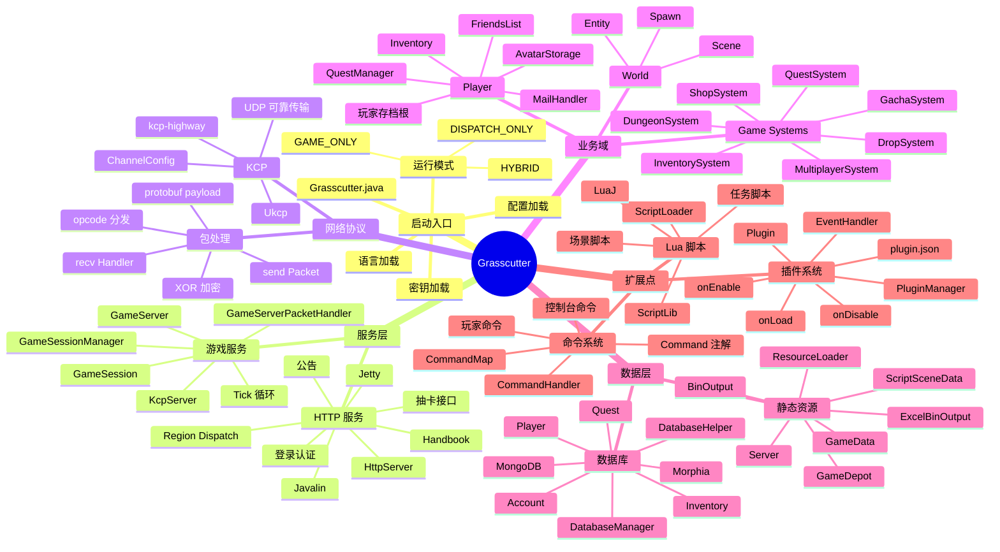
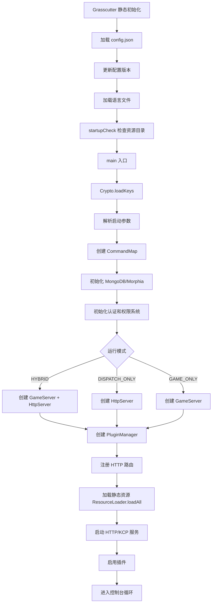
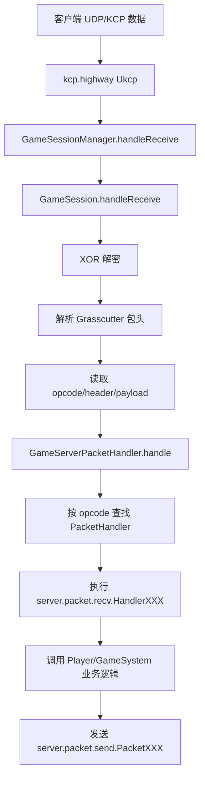
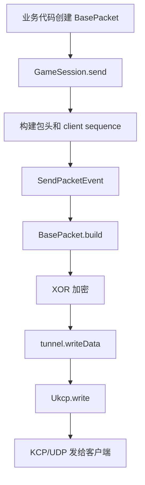

# Grasscutter 工程架构梳理

本文档基于当前工程源码结构整理，聚焦服务启动、模块分层、网络通信、数据加载、存档、命令、插件和脚本系统。

## 一句话概览

Grasscutter 是一个 Java/Gradle 单体游戏服务器。它同时包含 HTTP dispatch/auth 服务、KCP 游戏服、静态资源加载、MongoDB 存档、命令系统、插件系统和 Lua 场景脚本系统。

## 脑图



## 顶层目录

```text
src/main/java/emu/grasscutter
├─ Grasscutter.java        启动入口和全局装配
├─ auth                    认证系统
├─ command                 控制台/玩家命令
├─ config                  config.json 配置模型
├─ data                    静态资源加载和 GameData 缓存
├─ database                MongoDB/Morphia 存档层
├─ game                    玩家、世界、背包、任务、副本等业务域
├─ net                     Packet、opcode、protobuf 协议辅助
├─ plugin                  插件加载和生命周期
├─ scripts                 LuaJ 脚本系统
├─ server                  HTTP、KCP 游戏服、事件、包处理
├─ task                    任务调度辅助
├─ tools                   GM handbook、gacha mapping 等工具
└─ utils                   文件、加密、语言、JSON 等工具
```

`src/generated/main/java/emu/grasscutter/net/proto` 是 protobuf 生成代码，主要作为协议 DTO 使用，不是核心业务逻辑。

## 启动流程

入口类是 `emu.grasscutter.Grasscutter`。



运行模式：

```text
HYBRID        HTTP dispatch/auth + KCP 游戏服
DISPATCH_ONLY 只运行 HTTP/dispatch
GAME_ONLY     只运行游戏服，并连接外部 dispatch
```

## 服务层

### HTTP 服务

HTTP 服务由 `server/http/HttpServer.java` 管理，底层是 Javalin + Jetty。

主要职责：

```text
登录/认证
Region dispatch
公告接口
抽卡记录和页面
Documentation/Handbook
静态页面
未匹配路由处理
```

主要路由在 `Grasscutter.main()` 中注册：

```text
RegionHandler
LogHandler
GenericHandler
AnnouncementsHandler
AuthenticationHandler
GachaHandler
DocumentationServerHandler
HandbookHandler
```

### 游戏服务

游戏服务由 `server/game/GameServer.java` 管理，继承 `kcp.highway.KcpServer`。

它负责：

```text
监听 KCP/UDP 游戏端口
维护在线玩家列表
维护 World/HomeWorld 集合
创建跨玩家系统
运行每秒 tick
处理服务器关闭保存
```

`GameServer` 构造时会创建一批系统：

```text
InventorySystem
GachaSystem
ShopSystem
MultiplayerSystem
HomeWorldMPSystem
DungeonSystem
DropSystem
WorldDataSystem
BattlePassSystem
QuestSystem
TalkSystem
AnnouncementSystem
```

## KCP 和协议分发

KCP 由本地依赖 `lib/kcp-1.5.1.jar` 提供，包名是 `kcp.highway`。

服务端配置在 `GameServer`：

```java
var channelConfig = new ChannelConfig();
channelConfig.nodelay(true, GAME_INFO.kcpInterval, 2, true);
channelConfig.setMtu(1400);
channelConfig.setSndwnd(256);
channelConfig.setRcvwnd(256);
channelConfig.setTimeoutMillis(30 * 1000);
channelConfig.setUseConvChannel(true);
channelConfig.setAckNoDelay(false);
```

连接生命周期在 `GameSessionManager`：

```text
onConnected(Ukcp)   创建 GameSession
handleReceive(...)  转给 GameSession.handleReceive
handleClose(Ukcp)   玩家下线和移除 session
```

收包流程：



发包流程：



业务代码通常不直接调用 `Ukcp.write()`，而是调用：

```java
player.getSession().send(new PacketXXX(...));
```

## 数据层

### 静态资源

静态资源由 `data/ResourceLoader.java` 加载，结果缓存到 `data/GameData.java` 和 `GameDepot`。

关键资源目录：

```text
resources/BinOutput
resources/ExcelBinOutput
resources/Server
resources/ScriptSceneData
resources/Scripts
data/
```

其中 `BinOutput` 和 `ExcelBinOutput` 是硬性启动依赖。缺少时 `Utils.startupCheck()` 会直接退出。

`ResourceLoader.loadAll()` 的主要工作：

```text
初始化 ScriptLoader
加载 BinOutput 配置
加载 ability/talent/open config
扫描 GameResource 子类并加载 ExcelBinOutput
构建 GameDepot
加载 spawn/quest/scene point/homeworld/routes
加载 Server 自定义资源
加载活动配置
加载实体控制脚本
```

### 数据库存档

数据库使用 MongoDB + Morphia。

配置位置：

```text
config.json -> databaseInfo
```

当前结构：

```json
"databaseInfo": {
  "server": {
    "connectionUri": "mongodb://localhost:27017",
    "collection": "grasscutter"
  },
  "game": {
    "connectionUri": "mongodb://localhost:27017",
    "collection": "grasscutter"
  }
}
```

注意：这里的 `collection` 实际作为 MongoDB database 名使用。

核心类：

```text
DatabaseManager  初始化 MongoClient、Datastore、索引
DatabaseHelper   账号/玩家/物品/任务等读写辅助
```

## 业务域结构

`game/player/Player.java` 是核心玩家聚合根，也是 Morphia 持久化实体。

`Player` 中包含：

```text
账号绑定
基础属性
位置和场景
已解锁内容
任务变量
社交展示
月卡信息
运行时 session
运行时 manager
```

玩家级 manager：

```text
AvatarStorage
Inventory
FriendsList
MailHandler
AbilityManager
QuestManager
TowerManager
StaminaManager
EnergyManager
ForgingManager
BattlePassManager
ActivityManager
TalkManager
```

整体调用模式：

```text
PacketHandler 收到客户端请求
  -> 读取 protobuf payload
  -> 调用 Player 或 GameServer 上的 System
  -> 修改玩家/世界/数据库状态
  -> 构造 PacketXXX 响应或广播
```

## 命令系统

命令系统在 `command` 包。

核心类：

```text
CommandMap       命令注册和分发
Command          命令注解
CommandHandler   命令执行接口
```

注册方式是运行时扫描 `@Command` 注解。

命令来源：

```text
服务器控制台
玩家聊天命令
插件注册命令
```

`CommandMap.invoke()` 会做：

```text
解析 label 和参数
解析目标玩家
检查权限
检查目标在线/离线约束
触发 ExecuteCommandEvent
执行 CommandHandler
```

## 插件和事件系统

插件系统在 `plugin` 包。

核心类：

```text
PluginManager
Plugin
PluginConfig
PluginIdentifier
ServerHelper
```

插件加载目录：

```text
plugins/*.jar
```

每个插件 jar 需要包含：

```text
plugin.json
```

生命周期：

```text
onLoad()
onEnable()
onDisable()
```

事件系统在 `server/event`，支持插件监听：

```text
收包 ReceivePacketEvent
发包 SendPacketEvent
命令 ExecuteCommandEvent
玩家移动 PlayerMoveEvent
任务完成 PlayerCompleteQuestEvent
服务器启动/停止 ServerStartEvent / ServerStopEvent
实体创建/死亡/伤害事件
```

## Lua 脚本系统

脚本系统在 `scripts/ScriptLoader.java`，底层使用 LuaJ。

主要职责：

```text
初始化 LuaScriptEngine
加载和缓存 Lua 源码
编译和缓存 Lua 脚本
提供 require 支持
暴露 ScriptLib 给 Lua
加载场景、任务、group、trigger 脚本
```

Lua 常用于：

```text
场景 group
机关和 region
任务 share config
副本挑战逻辑
实体控制
```

## 关键链路总结

### 客户端登录到进入游戏

```text
HTTP dispatch/auth
  -> 客户端拿 region/game server 信息
  -> KCP 连接 GameServer
  -> GetPlayerTokenReq
  -> PlayerLoginReq
  -> 初始化 Player/World/Scene
  -> 发送登录初始化包
  -> SessionState.ACTIVE
```

### 服务端主动发消息给客户端

```text
业务系统
  -> new PacketXXX
  -> player.getSession().send(packet)
  -> BasePacket.build
  -> XOR 加密
  -> Ukcp.write
  -> KCP/UDP
```

### 静态资源和存档边界

```text
GameData/GameDepot
  静态配置、Excel、BinOutput、地图点位、怪物配置、任务配置

MongoDB/Morphia
  账号、玩家、背包、角色、邮件、任务进度、抽卡记录、家园等运行时状态
```

## 当前启动依赖注意点

服务启动前必须满足：

```text
resources/BinOutput
resources/ExcelBinOutput
MongoDB 可连接
JDK 可用
```

推荐额外准备：

```text
resources/Server
resources/ScriptSceneData
resources/Scripts
```

如果缺少 `BinOutput` 或 `ExcelBinOutput`，程序会在 `Utils.startupCheck()` 阶段退出，尚未进入 MongoDB、HTTP 或 KCP 启动。

